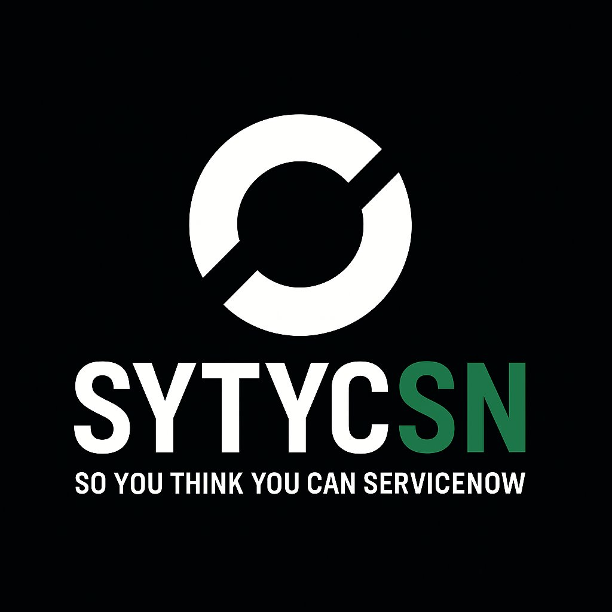

# SYTYCSN Adaptive Learning Tutor

> **"Fix the Practice. Unlock the Platform."™**

An AI-powered architectural thinking simulator for ServiceNow practitioners. Based on the *So You Think You Can ServiceNow* Foundation Trilogy.



## What Is This?

This isn't certification prep. It's **architectural thinking training**.

The SYTYCSN Adaptive Learning Tutor teaches you to think like a senior ServiceNow architect through scenario-based practice. Work through real engagement situations, get challenged on your reasoning, and develop the judgment that separates great architects from good technicians.

**Meet Aeryn** — your AI mentor. She'll challenge your thinking, catch your mistakes, and push you to think strategically about CMDB implementations.

## Current Content

### Chapter 2: Understanding the Territory
*Before you model it, understand it*

| Module | Title | Focus |
|--------|-------|-------|
| 2.1 | The CMDB Serves Its Consumers | Why the CMDB exists |
| 2.2 | The Infrastructure Pyramid | Universal structure, variable flavors |
| 2.3 | Greenfield Meets Brownfield | Bridging ServiceNow's expectations with customer reality |
| 2.4 | The Right Questions | Discovery through questions, not answers |
| 2.5 | From Discovery to Strategy | Turning landscape understanding into priorities |

## The Learning Model

Each module follows a **PRESENT → ENGAGE → ASSESS → COMPLETE** flow:

1. **PRESENT** — Learn the concept
2. **ENGAGE** — Apply it in a realistic scenario with Aeryn
3. **ASSESS** — Quick check to lock in the learning
4. **COMPLETE** — Key takeaway and next steps

The tutor adapts to your responses. Give a surface-level answer, and Aeryn will push you deeper. Demonstrate real understanding, and she'll acknowledge it and move on.

## Key Principles Taught

- The CMDB exists to serve processes — not itself
- The Infrastructure Pyramid is universal — flavors change, structure doesn't
- Your job is to bridge greenfield (ServiceNow's expectations) and brownfield (customer reality)
- The right questions reveal the flavor — that's the skill
- Discovery produces strategy, not documentation

## Tech Stack

- **Next.js** — React framework
- **Tailwind CSS** — Styling
- **Claude API** — AI tutor powered by Anthropic

## Local Development

```bash
npm install
npm run dev
```

Requires `ANTHROPIC_API_KEY` environment variable.

## About SYTYCSN

**So You Think You Can ServiceNow** is a methodology and book series that teaches ServiceNow delivery the way it should be done — with architectural thinking, disciplined practice, and frameworks that actually work.

- **Book 1:** Product, Platform & Practice
- **Book 2:** Delivery Framework
- **Book 3:** CMDB & CSDM

Learn more at [sytycsn.com](https://sytycsn.com)

---

© 2026 SYTYCSN Inc. All rights reserved.

*POC v0.5 — The Architect Simulator*
